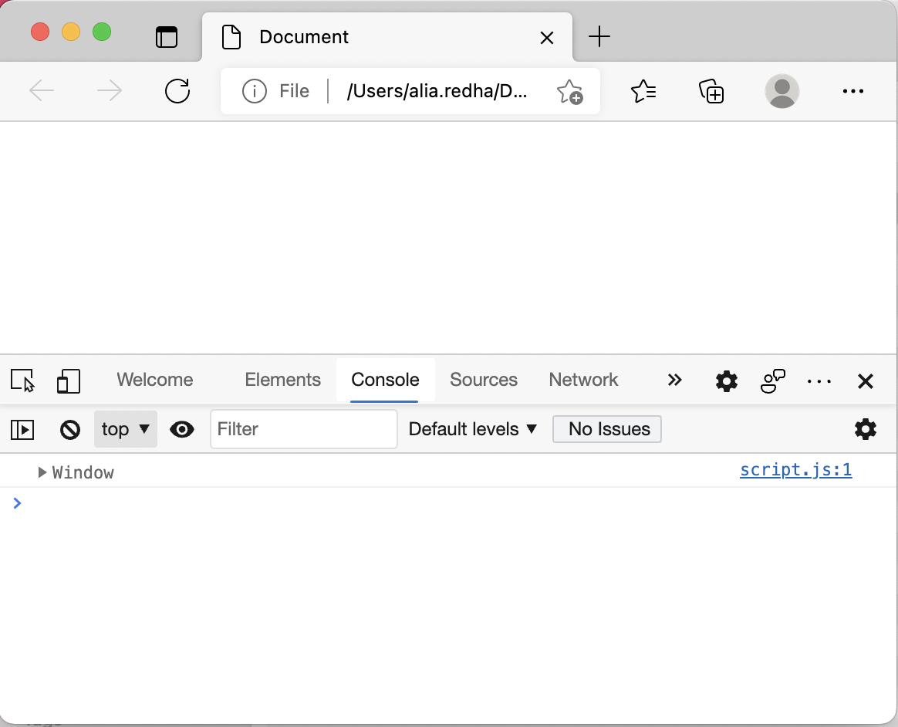
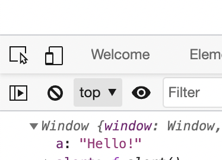
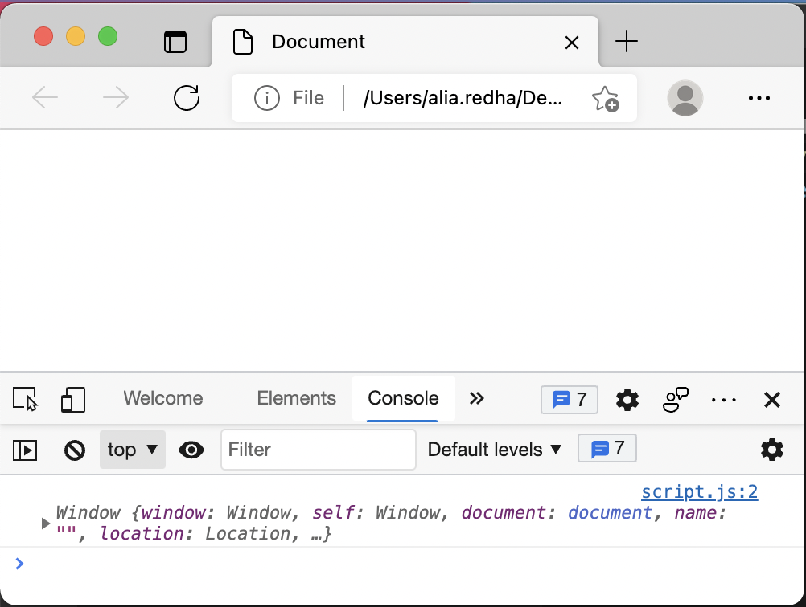
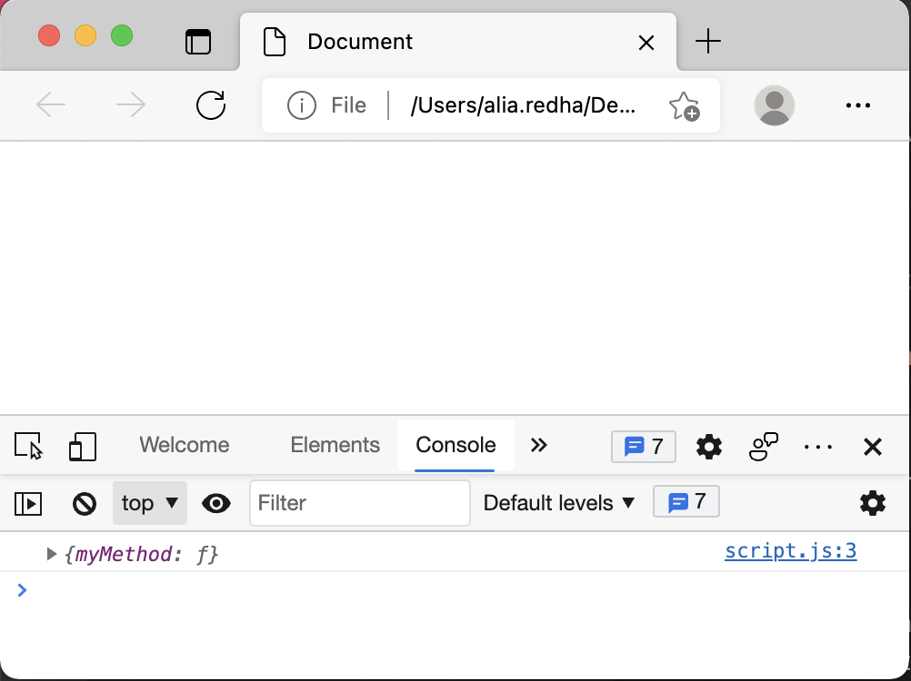
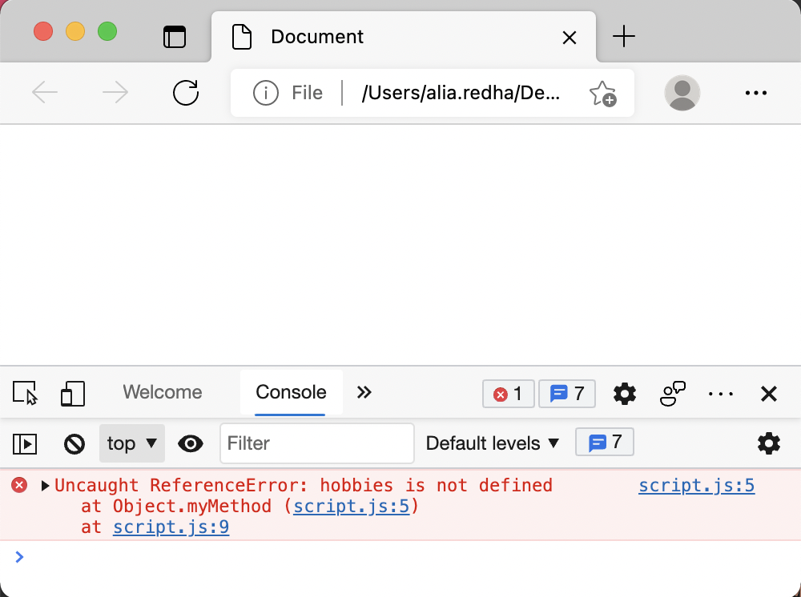
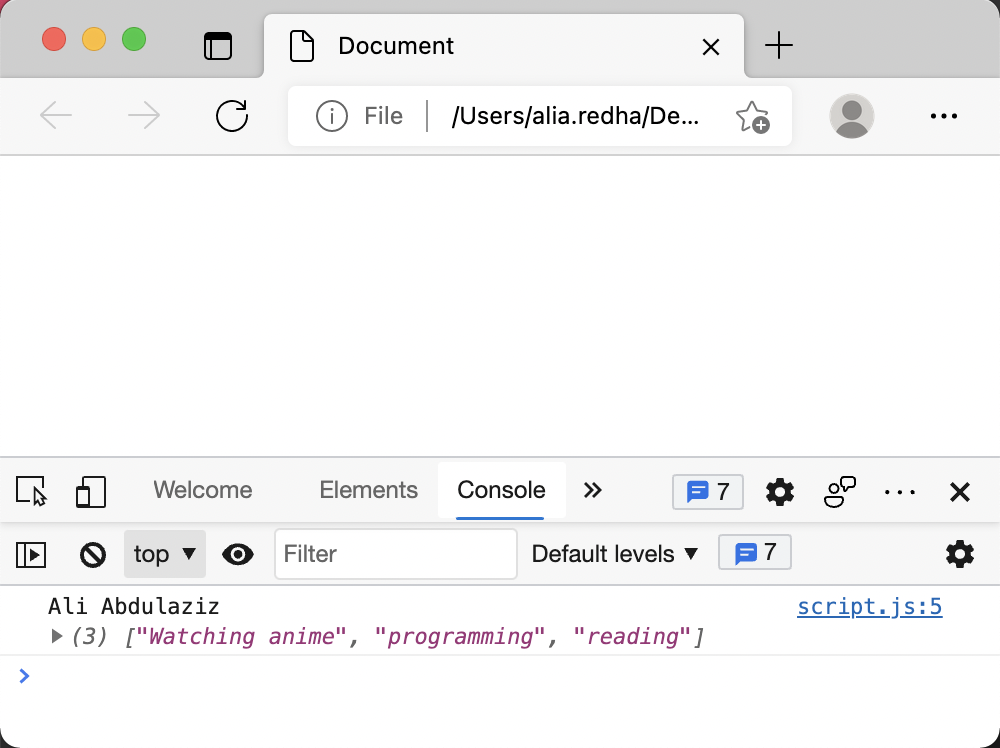

# JavaScript this keyword

So, what is `this` in JavaScript?

Simply put, `this` is a word refering to some object. I'm saying (some) because the object to which `this` refers depends on the context.

## Using this in the global scope

For example, let's create the following files:

**index.html**

```html
<!DOCTYPE html>
<html>
<head>
    <title>Document</title>
</head>
<body>
    <script src="script.js"></script>
</body>
</html>
```

**script.js**

```js
console.log(this)
```

Now if you open the `index.html` in your browser, and go to the console you will see the following:



As you can seee, `this` is refering to `window`. But what is window?

`window` is an object which is automatically created by the browser to represent the global scope.

If you, for example, declare a variable inside the `script.js` file:

```js
console.log(this);

var a = "Hello!";
```

As you can see, the variable `a` is declared in the global scope, and because the `window` represents the global scope in the browser, the vriable `a` is now a part of the `window` object:



If we want to print the value of `a` in the console, we usually do something like this:

```js
console.log(a);
```

But we can also do something like this:

```js
console.log(window.a);
```

## Using this inside a function

Now let's delete everything in the `script.js` file, and declare a function called `myFunction` which also prints the value of `this` in the console, and let's call that function:

```js
// declaring the function
function myFunction() {
    console.log(this);
}

// calling the function
myFunction();
```

Let's open the browser and go to the console to see what `this` is refering to now:



It is still refering to the `window` object.

## Using this inside a method

Now again, let's delete everything inside the `script.js` file and create an object which has a method called `myMethod` which also prints `this` in the console and see what we will get when we call that method:

```js
// declaring the object which has myMethod
var myObject = {
    myMethod() {
        console.log(this);
    }
}

// calling myMethod
myObject.myMethod();
```



You can see that `this` is now refering to an object which has a method called `myMethod`. And what object is that? Yes, it is `myObject`.

Now let's create some properties in `myObject` an see how we can access these properties inside `myMethod`.

```js
var myObject = {
    name: "Ali Abdulaziz",
    hobbies: ["Watching anime", "programming", "reading"],
    myMethod() {
        // trying to access to properties directly
        console.log(name, hobbies);
    }
}

myObject.myMethod();
```

If we try to access the properties this way, we get the following error:



To fix this error we can use the object name:

```js
var myObject = {
    name: "Ali Abdulaziz",
    hobbies: ["Watching anime", "programming", "reading"],
    myMethod() {
        // now we are using the object name to access the properties
        console.log(myObject.name, myObject.hobbies);
    }
}

myObject.myMethod();
```


It is fine to use the object name to access the properties, but what if we are using a constructor to create the object. 

The constructor is not an object. The constructor is just a function that we use to create the object. So how are we going to refer to that object (which will be created by the constructor)? Is there a way that we can use to refer to the object without using its name? Yes, you are correct. we can use the `this` keyword.

```js
var myObject = {
    name: "Ali Abdulaziz",
    hobbies: ["Watching anime", "programming", "reading"],
    myMethod() {
        // using this instead of the object name
        console.log(this.name, this.hobbies);
    }
}

myObject.myMethod();
```



As you can see we get the same result.

## Using this inside a constructor

Let's declare a constructor called `Person` (with capital 'P'):

```js
// declaring the constructor
function Person(name, hobbies) {
    this.name = name;
    this.hobbies = hobbies;
    this.printObjectData = function () {
        console.log(this.name, this.hobbies);
    }
}
```

As you can see we used `this` inside the `Person` constructor, but `this` does not refer to `Person`. It refers to the objects that will be created later using the constructor. So whatever object we create using `Person`, the `this` keyword will refer to that object.

For example, Let's use `Person` to create two objects, and see what `this` refers to:

```js
// (this) here refers to (o1)
const o1 = new Person("Ali Abdulaziz", ["Watching anime", "programming", "reading"]);

// (this) here refers to (o2)
const o2 = new Person("Mina Youssef", ["Programming", "Travelling"]);
```

## Using the bind() method

In JavaScript, the Function proptotype has a method called `bind()`, what this method does is creating a new function that, when called, has its `this` keyword set to the provided value.

Let's see what that means by an example.

Say we have the following function:

```js
function printName() {
    console.log(this.fullName);
}

printName(); // prints undefined in the console
```

When we call this function, we get an `undefined`. The reason is that `this` is in this case, as you learned, refering to the `window` object, and the `window` object doesn't have a property called `fullName`. However, we can bind the `printName` method to an object that has a `fullName` property:

```js
function printName() {
    console.log(this.fullName);
}

const myObject = {
    fullName: "Ali Abdulaziz"
};

const myFunction = printName.bind(myObject);

myFunction(); // prints Ali Abdulaziz in the console
```

It doesn't necessarily have to be a function. It can be a mthod:

```js
const o1 = {
    // printName is a method of o1
    printName: function () {
        console.log(this.fullName);
    }
}

// o1 doesn't have a property called fullName

// o2 however has a property called fullName
const o2 = {
    fullName: "Ali Abdulaziz"
};

// let's bind the o1.printName method to o2
const myFunction = o1.printName.bind(o2);

myFunction() // prints Ali Abdulaziz in the console
```

## Using the bind() method in React

In React you use the `bind()` method to bind the component object to the event handler method:

```jsx
class Toggle extends React.Component {
    constructor(props) {
        super(props);
        this.state = {isToggleOn: true};

        // Binding the component object to the handleclick method.
        // The this keyword here refers to the component object.
        this.handleClick = this.handleClick.bind(this);
    }

    // The event handler method
    handleClick() {
        this.setState(prevState => ({
            isToggleOn: !prevState.isToggleOn
        }));
    }

    render() {
        return (
            // we are using the event onClick to trigger the
            // handleClick method
            <button onClick={this.handleClick}>
                {this.state.isToggleOn ? 'ON' : 'OFF'}
            </button>
        );
    }
}
```

If you don't bind the component object to the `handleClick` method, the value of `this` inside the `handleClick` method will be `undefined`. As a result, you will not be able to use `this.setState()`.